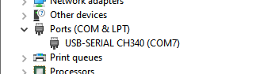
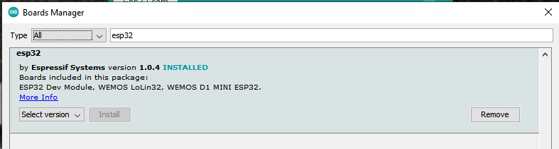
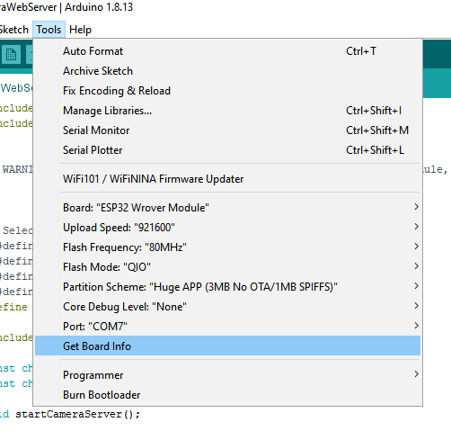

## How To use with Arduino IDE

0. Install **ESP32-CAM-MB** Driver

    - **Windows 10** !!! Use with **IC CH340**

        Download and Install this [CH341SER.zip](../../Files/CH341SER.zip)
    
        

1. Install **Arduino IDE** and open it
2. Goto `File` → `Preferences`

   Add this url `https://dl.espressif.com/dl/package_esp32_index.json` in **Additional Board Manager URLs**

3. Goto `Tools` → `Board` → `Board Manager` then install `ESP32`

   

4. Goto `Tools` → `Board` then select setting follow this image

   

5. Select Camera Model : `AI_THINKER Model`

   ```Arduino
   // Select camera model
   //#define CAMERA_MODEL_WROVER_KIT
   //#define CAMERA_MODEL_ESP_EYE
   //#define CAMERA_MODEL_M5STACK_PSRAM
   //#define CAMERA_MODEL_M5STACK_WIDE
   #define CAMERA_MODEL_AI_THINKER
   ```
